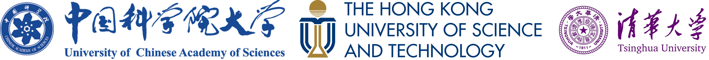

Hi, this is Shing-Ho J. Lin (call me Jonathan) from Hong Kong, currently pursuing my B.Eng. degree in [*School of Artificial Intelligence, University of Chinese Academy of Sciences (UCAS)*](https://www.ucas.ac.cn). 
Previously I was a visiting student at the [*Schoolf of Engineering, Hong Kong University of Science and Technology (HKUST)*](https://seng.hkust.edu.hk/).

I will be joining [*Department of Automation, Tsinghua University (THU)*](https://www.au.tsinghua.edu.cn/) from September 2025 to start my Master study.

My interests lie broadly in representation learning, including the geometric deep learning (especially in Hyperbolic Geometry), as well as brain-inspired methods (Reservoir Computing). 
I am deeply honored to be a Principal Investigator, funded by the [*Beijing Natural Science Foundation (BJNSF)*](https://nsf.kw.beijing.gov.cn/bjnsfweb/) during my undergraduate study.

I am extremely privileged to be the only recipient at UCAS for the *National 2nd Scholarship for Hong Kong, Macao and Overseas Chinese students* (Undergraduate, highest level), by [Ministry of Education of the People's Republic of China](https://www.moe.gov.cn).

* [2024.12.10] 1 paper had been accepted by AAAI (*Oral Presentation*) (CCF-A)
* [2024.09.20] 1 paper had been accepted by Pattern Recognition (CAS Tier 1 Top, IF7.5)
