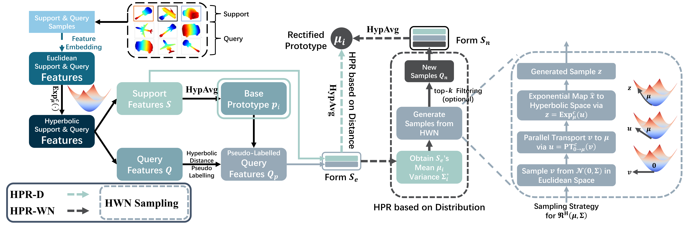

Few-shot point cloud classification is a challenging task in 3D computer vision and has received widespread attention from researchers. Most of the works on deep learning models rely heavily on Euclidean spatial metrics. However, point cloud objects often have complex non-Euclidean geometric structures, with underlying inter/intra-class hierarchical structures, which are difficult to capture by current Euclidean-based deep learning models. Moreover, due to the lack of training samples, many few-shot learning methods often suffer from the overfitting problem. Given the Hyperbolic metric of non-Euclidean geometry offering hierarchical structural prior, as we assume to be able to assist FSL task, we propose Hyperbolic Prototype Rectification (HPR) for few-shot point cloud classification, without requiring extra learnable parameter. Firstly, point clouds are embedded into hyperbolic space to better describe hierarchical similarity relationships in data. Secondly, the HPR utilizes hyperbolic spatial and distributional information to enhance the feature representation and improve the generalization capability, with more appropriate hyperbolic prototypes. The few-shot classification experiments and further ablation studies conducted on widely used point cloud datasets demonstrate the effectiveness of our method. On the real-world ScanObjectNN(-PB) datasets, the average classification accuracy outperforms the SOTA method by 2.08%(0.66%), respectively, indicating that the proposed HPR has great generalization capability and strong robustness against perturbed data. Our code is available at: https://github.com/Jonathan-UCAS/HPR.

